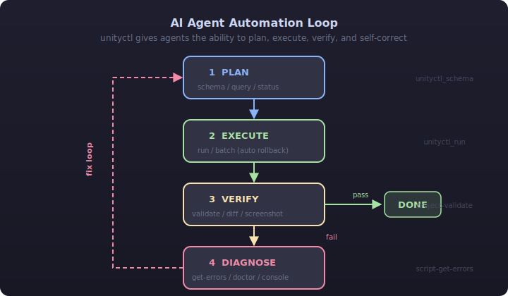
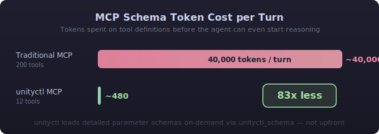

# unityctl

[English](README.md) | [한국어](README.ko.md)

[](https://www.nuget.org/packages/unityctl)
[](https://www.nuget.org/packages/unityctl-mcp)
[](https://github.com/kimjuyoung1127/unityctl/actions)
[](LICENSE)

### AI 기반 게임 개발을 위한 실행 레이어.

AI 에이전트에게 **131개 명령**을 제공하여 Unity 씬 구성, C# 스크립트 작성, 빌드 검증, 게임 배포까지 — 문제가 생기면 자동 롤백합니다.

```
131 CLI 명령 · 12 MCP 도구 · 689 테스트 · Windows / macOS / Linux
```

<p align="center">
  
</p>

---

## 문제

AI 에이전트는 코드를 작성할 수 있지만, **게임을 만들 수는 없습니다** — Unity에 씬 편집, 에셋 관리, 프로젝트 검증을 위한 프로그래밍 인터페이스가 없기 때문입니다.

기존 Unity MCP 서버들은 이 문제를 해결하려 하지만, AI 에이전트에게 새로운 문제를 만듭니다:

| 문제점 | AI 에이전트에 미치는 영향 |
|---|---|
| **45 KB 이상의 스키마**가 매 턴 로드 | 추론 대신 도구 정의에 토큰 낭비 |
| **검증 피드백 없음** | 변경 후 씬이 깨졌는지 알 수 없음 |
| **롤백 없음** | 잘못된 명령 하나로 프로젝트 상태 오염 |
| **Play Mode에서 WebSocket 끊김** | Unity의 Domain Reload 중 연결 끊김 |
| **에디터가 열려 있어야 함** | GUI 없이 CI/CD 파이프라인 실행 불가 |

## 해결책

unityctl은 Unity Editor를 프로그래밍 가능한 API로 만드는 **.NET CLI + MCP 서버**입니다.

AI 에이전트에게 이것은 **폐쇄 루프 자동화 사이클**을 의미합니다 — 에이전트가 명령을 _실행_할 뿐만 아니라, 결과를 _검증_하고, 실패를 _진단_하고, 실수를 _복구_할 수 있습니다:

<p align="center">
  
</p>

> **다른 도구는 에이전트에게 손을 줍니다. unityctl은 손, 눈, 그리고 안전망을 줍니다.**

---

## AI 에이전트가 만들 수 있는 것

### 씬 구성

> _"바닥, 벽, 플레이어 스폰 포인트가 있는 플랫포머 레벨을 만들어줘"_

```bash
# 에이전트가 씬 구조를 생성
unityctl scene create --path "Assets/Scenes/Level01.unity" --project $P
unityctl mesh create-primitive --type Plane --name "Floor" --scale "[10,1,10]" --project $P
unityctl mesh create-primitive --type Cube --name "Wall" --position "[5,1,0]" --scale "[0.5,2,10]" --project $P
unityctl gameobject create --name "PlayerSpawn" --project $P
unityctl component add --id "<PlayerSpawnId>" --type "BoxCollider" --project $P

# 에이전트가 씬을 검증
unityctl scene hierarchy --project $P --json      # 구조 확인
unityctl screenshot capture --project $P           # 시각적 검증
unityctl project validate --project $P --json      # 카메라? 조명? 에러?
```

### 컴파일 검증이 포함된 스크립트 작성

> _"플레이어 이동 스크립트를 작성하고 컴파일되는지 확인해줘"_

```bash
# 에이전트가 코드 작성
unityctl script create --path "Assets/Scripts/PlayerMovement.cs" --className "PlayerMovement" --project $P
unityctl script patch --path "Assets/Scripts/PlayerMovement.cs" \
  --startLine 8 --insertContent "public float speed = 5f;" --project $P

# 에이전트가 컴파일을 확인하고 — 에러가 있으면 루프에서 수정
unityctl script validate --project $P --wait       # 리컴파일 트리거
unityctl script get-errors --project $P --json     # 구조화된 CS 에러
# 에러가 있으면: 에러 읽기, 패치 수정, 다시 검증
```

### 롤백이 포함된 안전한 배치 작업

> _"Player, Enemy, Projectile 물리 레이어를 설정해 — 실패하면 롤백해줘"_

```bash
unityctl batch execute --project $P --rollbackOnFailure true --commands '[
  {"command": "layer-set", "parameters": {"index": 8, "name": "Player"}},
  {"command": "layer-set", "parameters": {"index": 9, "name": "Enemy"}},
  {"command": "layer-set", "parameters": {"index": 10, "name": "Projectile"}},
  {"command": "physics-set-collision-matrix", "parameters": {"layer1": 10, "layer2": 10, "ignore": true}}
]'
# 어떤 명령이 실패하면, 모든 변경사항이 Undo를 통해 자동 롤백
```

### 빌드 검증 파이프라인

> _"프로젝트가 출시 준비가 됐는지 확인해줘"_

<p align="center">
  
</p>

```bash
# 에이전트가 실패를 읽고, 수정하고, 다시 검증
unityctl gameobject create --name "Main Camera" --project $P
unityctl component add --id "<MainCameraId>" --type "Camera" --project $P
unityctl gameobject set-tag --id "<MainCameraId>" --tag "MainCamera" --project $P
unityctl project validate --project $P --json   # valid: true
```

---

## 처음 만들어볼 것

unityctl을 공개적으로 증명하고 싶다면, 마인크래프트부터 시작하지 마세요.
현재 툴체인에서 가장 강력하게 검증된 루프에 맞는 쇼케이스 사다리부터 시작하세요:

1. **Zero-to-playable**: 프리미티브, 스크립트, UI, 물리, 검증 아티팩트로 만든 작은 3D 아레나 마이크로게임.
2. **버티컬 슬라이스**: 프리팹, NavMesh, 머티리얼, 오디오, 빌드 검증이 포함된 탑다운 서바이벌 또는 기지 방어 프로토타입으로 확장.
3. **샌드박스 단계**: 그 다음에야 청크 월드, 크래프팅, 절차적 터레인, 세이브 시스템으로 이동.

unityctl의 최고의 첫 번째 쇼케이스는 오픈월드 샌드박스가 아니라 **작은 3D 서바이벌/기지 방어 게임**입니다.
스크린샷과 GIF로 이해하기 쉽고, 씬 편집 + 스크립트 패칭 + 롤백 + 시각적 검증에 깔끔하게 매핑되며, 나중에 더 복잡한 샌드박스로 성장할 수 있습니다.

자세한 내용은 [쇼케이스 로드맵](docs/ref/showcase-roadmap.md)을 참조하세요.

---

## 왜 AI 에이전트에게 unityctl인가?

| | unityctl | 기존 Unity MCP |
|---|---|---|
| **스키마 오버헤드** | 세션당 **5 KB** (9배 작음) | 매 턴 45 KB 이상 로드 |
| **검증 루프** | `project validate` + `scene diff` + `screenshot capture` | 에이전트가 눈먼 채로 비행 |
| **에러 복구** | `script get-errors` (파일/줄/열/코드) | 가공되지 않은 콘솔 출력 또는 없음 |
| **안전한 실험** | `batch execute --rollbackOnFailure` + `undo` | 롤백 없음 — 실수가 영구적 |
| **연결 안정성** | Named Pipe — Domain Reload에도 유지 | WebSocket 끊김, 재연결 필요 |
| **CI/CD** | `check` / `test` / `build --dry-run` 헤드리스 동작 | 에디터가 열려 있어야 함 |
| **진단** | `doctor`가 실패를 분류하고 다음 단계 제안 | "Connection failed" |
| **명령 수** | **131** (읽기 + 쓰기 + 검증 + 진단) | ~34-200 도구 |
| **감사 추적** | 모든 명령에 대한 NDJSON 플라이트 레코더 | 이력 없음 |
| **런타임** | 네이티브 .NET — Python/TS 브릿지 없음 | 브릿지 오버헤드 |
| **설치** | `dotnet tool install -g unityctl` | Node.js + npm + 포트 설정 |
| **라이선스** | **MIT** | 다양 |

### 토큰 효율성

AI 에이전트 비용은 매 턴 전송되는 도구 스키마에 의해 지배됩니다. unityctl은 **온디맨드 스키마 로딩**을 사용합니다:

<p align="center">
  
</p>

12개의 MCP 도구가 `unityctl_query` (읽기), `unityctl_run` (쓰기), `unityctl_schema` (조회)를 통해 전체 131개 명령을 커버합니다.

---

## 선택 기반 라우팅

```bash
# 현재 Unity 프로젝트를 한 번 고정
unityctl editor select --project /path/to/project

# 또는 하나의 프로젝트에 매핑되는 실행 중인 Unity PID를 고정
unityctl editor select --pid 55028

# 현재 선택 확인
unityctl editor current --json

# PID / 프로젝트 / IPC 상태와 함께 실행 중인 Unity 인스턴스 보기
unityctl editor instances --json

# 이제 이 CLI 명령들은 --project를 생략 가능
unityctl ping --json
unityctl status --json
unityctl check --json
unityctl doctor --json

# 작은 검증 번들 실행 (아티팩트 우선)
unityctl workflow verify --file verify.json --project /path/to/project --json
```

## 설치

```bash
# CLI (.NET 10 SDK 필요)
dotnet tool install -g unityctl

# AI 에이전트용 MCP 서버
dotnet tool install -g unityctl-mcp
```

부트스트랩 참고:
- `--source`는 로컬 `Unityctl.Plugin` 폴더 또는 Git URL을 받습니다: `https://github.com/kimjuyoung1127/unityctl.git?path=/src/Unityctl.Plugin#v0.2.0`
- GitHub Release CLI 아카이브는 현재 프레임워크 의존(self-contained가 아닌) 배포입니다.

### Apple Silicon macOS 검증

Apple silicon MacBook Air에서 Homebrew, .NET SDK `10.0.105`, Unity Hub, Unity 에디터 `6000.0.64f1` 및 `6000.3.11f1`을 사용하여 수동 검증을 완료했습니다.

검증된 경로:

- `dotnet tool install -g unityctl`
- `dotnet tool install -g unityctl-mcp`
- `unityctl editor list`
- `unityctl init --project <project> --source /path/to/unityctl/src/Unityctl.Plugin`
- `unityctl ping --project <project> --json`
- `unityctl doctor --project <project> --json`
- `unityctl status --project <project> --json`
- `unityctl check --project <project> --json`

Unity `6000.0.64f1` 프로젝트에서 관찰된 결과: `ping`이 `pong`을 반환, `doctor`가 IPC 연결을 보고, `status`가 `Ready`를 반환, macOS에서 `check`가 통과했습니다.

프로젝트 호환성 참고: Unity 프로젝트나 서드파티 패키지가 Unity `6.0 LTS`에 고정되어 있으면, 같은 프로젝트를 `6000.3+`에서 열면 `unityctl`이 관여하기 전에 실패할 수 있습니다. 검증 중 해당 프로젝트를 고정된 `6000.0.64f1` 에디터에서 다시 열면 프로젝트 측 렌더 파이프라인 에러가 해결되었습니다.

## 빠른 시작

```bash
# 1. 에디터 플러그인 설치
unityctl init --project /path/to/project \
  --source "https://github.com/kimjuyoung1127/unityctl.git?path=/src/Unityctl.Plugin#v0.2.0"

# 2. Unity Editor에서 프로젝트를 열고, 연결 확인
unityctl ping --project /path/to/project --json
unityctl status --project /path/to/project --json

# 3. 빌드 시작
unityctl gameobject create --name "Player" --project /path/to/project
unityctl component add --id "<PlayerId>" --type "Rigidbody" --project /path/to/project
unityctl scene save --project /path/to/project

# 4. 검증
unityctl project validate --project /path/to/project --json

# 5. 빌드
unityctl build --project /path/to/project --dry-run    # 13개 사전 검증
```

### MCP 설정 (AI 에이전트)

Claude Code / Cursor / VS Code MCP 설정에 추가:

```json
{
  "mcpServers": {
    "unityctl": {
      "command": "unityctl-mcp"
    }
  }
}
```

<details>
<summary><strong>12 MCP 도구</strong></summary>

| 도구 | 타입 | 설명 |
|------|------|------|
| `unityctl_query` | 읽기 | 통합 읽기: 에셋, 게임오브젝트, 씬, 컴포넌트, UI, 물리, 조명, 태그 |
| `unityctl_run` | 쓰기 | 통합 쓰기: 생성, 삭제, 수정, 스크립트, 머티리얼, 프리팹, 배치 |
| `unityctl_schema` | 메타 | 온디맨드 파라미터 조회 (명령별 또는 카테고리별) |
| `unityctl_build` | 액션 | 13개 사전 검증이 포함된 플레이어 빌드 |
| `unityctl_check` | 액션 | 컴파일 검증 (헤드리스) |
| `unityctl_test` | 액션 | EditMode / PlayMode 테스트 |
| `unityctl_exec` | 액션 | 임의의 C# 표현식 실행 |
| `unityctl_status` | 읽기 | 에디터 상태 + 연결 |
| `unityctl_ping` | 읽기 | 빠른 연결 확인 |
| `unityctl_watch` | 스트림 | 실시간 콘솔/계층/컴파일 이벤트 |
| `unityctl_log` | 읽기 | 플라이트 레코더 쿼리 |
| `unityctl_session_list` | 읽기 | 활성 세션 목록 |

</details>

---

## 명령어 (131)

### 코어 (13)

| 명령어 | 설명 |
|--------|------|
| `ping` | Unity 연결 확인 |
| `status` | 에디터 상태 (Domain Reload용 `--wait` 스마트 폴링) |
| `check` | 스크립트 컴파일 검증 (헤드리스) |
| `build` | `--dry-run` 사전 검증(13개 체크) 포함 플레이어 빌드 |
| `test` | EditMode / PlayMode 테스트 실행 |
| `doctor` | 연결 진단 + 복구 단계 제안 |
| `project validate` | 게임 준비 상태 체크 (컴파일, 씬, 카메라, 조명, 콘솔, 에디터) |
| `init` | Unity 프로젝트에 플러그인 설치 |
| `editor list` | 설치된 Unity 에디터 탐색 |
| `editor instances` | 실행 중인 Unity Editor 인스턴스 나열 |
| `editor current` | 선택된 Unity 프로젝트 타겟 표시 |
| `editor select` | 프로젝트 없는 CLI 라우팅을 위해 Unity 프로젝트 타겟 또는 고유 실행 PID 선택 |
| `workflow verify` | 아티팩트 우선 검증 단계 실행 (`projectValidate`, `capture`, `imageDiff`, `consoleWatch`, `uiAssert`, `playSmoke`) |

<details>
<summary><strong>씬 & 게임오브젝트</strong> (19)</summary>

| 명령어 | 설명 |
|--------|------|
| `scene snapshot` | 씬 상태 캡처 |
| `scene hierarchy` | 씬 계층 트리 |
| `scene diff` | 엡실론이 포함된 프로퍼티 수준 씬 diff |
| `scene save` | 활성 씬 저장 |
| `scene open` | 경로로 씬 열기 |
| `scene create` | 새 씬 생성 |
| `gameobject create` | 게임오브젝트 생성 |
| `gameobject delete` | 게임오브젝트 삭제 |
| `gameobject rename` | 게임오브젝트 이름 변경 |
| `gameobject move` | 게임오브젝트 부모 변경 |
| `gameobject find` | 이름/태그/컴포넌트로 찾기 |
| `gameobject get` | 게임오브젝트 상세 정보 |
| `gameobject set-active` | 활성 상태 토글 |
| `gameobject set-tag` | 태그 설정 |
| `gameobject set-layer` | 레이어 설정 |
| `component add` | 컴포넌트 추가 |
| `component remove` | 컴포넌트 제거 |
| `component get` | 컴포넌트 프로퍼티 조회 |
| `component set-property` | 컴포넌트 프로퍼티 설정 |

</details>

<details>
<summary><strong>에셋 & 머티리얼</strong> (21)</summary>

| 명령어 | 설명 |
|--------|------|
| `asset find` | 타입/라벨/경로로 검색 |
| `asset get-info` | 에셋 메타데이터 |
| `asset get-dependencies` | 직접 의존성 |
| `asset reference-graph` | 역참조 그래프 |
| `asset create` | 에셋 생성 |
| `asset create-folder` | 폴더 생성 |
| `asset copy` | 에셋 복사 |
| `asset move` | 에셋 이동/이름 변경 |
| `asset delete` | 에셋 삭제 |
| `asset import` | 에셋 리임포트 |
| `asset refresh` | AssetDatabase 새로고침 |
| `asset get-labels` | 라벨 조회 |
| `asset set-labels` | 라벨 설정 |
| `material create` | 머티리얼 생성 |
| `material get` | 머티리얼 프로퍼티 조회 |
| `material set` | 머티리얼 프로퍼티 설정 |
| `material set-shader` | 셰이더 변경 |
| `prefab create` | 게임오브젝트에서 프리팹 생성 |
| `prefab unpack` | 프리팹 인스턴스 언팩 |
| `prefab apply` | 프리팹 오버라이드 적용 |
| `prefab edit` | 프리팹 편집 모드 진입/종료 |

</details>

<details>
<summary><strong>스크립팅 & 코드 분석</strong> (10)</summary>

| 명령어 | 설명 |
|--------|------|
| `script create` | 템플릿에서 C# 스크립트 생성 |
| `script edit` | 스크립트 내용 교체 (전체 파일) |
| `script patch` | 줄 단위 삽입/삭제/교체 |
| `script delete` | 스크립트 파일 삭제 |
| `script validate` | 컴파일 트리거 및 검증 |
| `script list` | MonoScript 에셋 나열 |
| `script get-errors` | 구조화된 컴파일 에러 (파일/줄/열/코드) |
| `script find-refs` | 모든 스크립트에서 심볼 참조 찾기 |
| `script rename-symbol` | 모든 스크립트에서 심볼 이름 변경 (`--dry-run` 포함) |
| `exec` | Unity에서 C# 표현식 실행 |

</details>

<details>
<summary><strong>에디터 제어</strong> (18)</summary>

| 명령어 | 설명 |
|--------|------|
| `play start/stop/pause` | 플레이 모드 시작, 중지, 일시정지 |
| `editor pause` | 에디터 일시정지 토글 |
| `editor focus-gameview` | Game View 포커스 |
| `editor focus-sceneview` | Scene View 포커스 |
| `player-settings get/set` | PlayerSettings 읽기/쓰기 |
| `project-settings get/set` | 프로젝트 설정 읽기/쓰기 |
| `console clear` | 콘솔 지우기 |
| `console get-count` | 로그/경고/에러 카운트 |
| `define-symbols get/set` | 스크립팅 정의 심볼 |
| `tag list/add` | 태그 관리 |
| `layer list/set` | 레이어 관리 |
| `undo` | 마지막 작업 취소 |
| `redo` | 마지막 취소된 작업 다시 실행 |

</details>

<details>
<summary><strong>빌드 & 배포</strong> (6)</summary>

| 명령어 | 설명 |
|--------|------|
| `build-profile list/get-active/set-active` | 빌드 프로필 관리 |
| `build-target switch` | 빌드 플랫폼 전환 |
| `build-settings get-scenes/set-scenes` | 빌드 씬 목록 |

</details>

<details>
<summary><strong>물리, 조명 & NavMesh</strong> (12)</summary>

| 명령어 | 설명 |
|--------|------|
| `physics get-settings/set-settings` | DynamicsManager |
| `physics get-collision-matrix/set-collision-matrix` | 32x32 레이어 충돌 |
| `lighting bake/cancel/clear` | 라이트맵 베이킹 |
| `lighting get-settings/set-settings` | 라이트맵 설정 |
| `navmesh bake/clear/get-settings` | NavMesh |

</details>

<details>
<summary><strong>UI & 메시</strong> (8)</summary>

| 명령어 | 설명 |
|--------|------|
| `ui canvas-create` | UI Canvas 생성 |
| `ui element-create` | Button, Text, Image 등 생성 |
| `ui set-rect` | RectTransform 설정 |
| `ui find` | UI 요소 찾기 |
| `ui get` | UI 요소 상세 정보 |
| `ui toggle` | Toggle 상태 설정 |
| `ui input` | InputField 텍스트 설정 |
| `mesh create-primitive` | Cube/Sphere/Plane/Cylinder/Capsule/Quad 생성 |

</details>

<details>
<summary><strong>자동화 & 모니터링</strong> (15)</summary>

| 명령어 | 설명 |
|--------|------|
| `batch execute` | 롤백이 포함된 트랜잭션 |
| `workflow run` | JSON 워크플로우 실행 |
| `watch` | 실시간 이벤트 스트리밍 |
| `log` | 플라이트 레코더 쿼리 |
| `session list/stop/clean` | 세션 관리 |
| `screenshot` | Scene/Game View 캡처 (base64) |
| `schema` / `tools` | 기계 판독 가능한 메타데이터 |
| `package list/add/remove` | 패키지 관리 |
| `animation create-clip/create-controller` | 애니메이션 에셋 |

</details>

---

## 아키텍처

```
AI 에이전트 (LLM)            unityctl-mcp              unityctl CLI             Unity Editor
Claude / GPT / Gemini         12 MCP 도구               131 명령                 플러그인 (IPC)
        |                          |                          |                       |
        |--- MCP (stdio) -------->|                          |                       |
        |                          |--- CLI 호출 ----------->|                       |
        |                          |                          |--- IPC (~100ms) ---->|
        |                          |                          |    또는 Batch (30s+)  |
        |                          |                          |<--- JSON 응답 -------|
        |                          |<--- 결과 ---------------|                       |
        |<--- 도구 결과 ----------|                          |                       |
```

```
unityctl.slnx
+-- src/Unityctl.Shared   (netstandard2.1)  프로토콜 + 모델
+-- src/Unityctl.Core     (net10.0)         비즈니스 로직
+-- src/Unityctl.Cli      (net10.0)         CLI 셸
+-- src/Unityctl.Mcp      (net10.0)         MCP 서버
+-- src/Unityctl.Plugin   (Unity UPM)       에디터 브릿지 (IPC 서버)
+-- tests/*                                 633 xUnit 테스트
```

---

## 플랫폼

| 플랫폼 | CLI | IPC 전송 | Batch | CI |
|--------|-----|----------|-------|----|
| Windows | ✅ | Named Pipe | ✅ | ✅ |
| macOS | ✅ | Unix Domain Socket | ✅ | ✅ |
| Linux | ✅ | Unix Domain Socket | ✅ | ✅ |

## 요구사항

- [.NET 10 SDK](https://dotnet.microsoft.com/download)
- [Unity 2021.3+](https://unity.com/download)

## 터미널 출력

<p align="center">
  
</p>

<p align="center">
  
</p>

<p align="center">
  
</p>

## 문서

- [시작하기](docs/ref/getting-started.md) — 설치, 설정, 일반 워크플로우
- [AI 에이전트 빠른 시작](docs/ref/ai-quickstart.md) — MCP 설정 및 에이전트 통합 가이드
- [쇼케이스 로드맵](docs/ref/showcase-roadmap.md) — 추천 데모 게임 사다리, 에셋 체크리스트, 사전 제작 계획
- [아키텍처](docs/ref/architecture-mermaid.md) — 시스템 설계 및 전송 다이어그램
- [용어 사전](docs/ref/glossary.md) — 주요 용어 및 개념

## 변경 이력

버전 이력은 [GitHub Releases](https://github.com/kimjuyoung1127/unityctl/releases)를 참조하세요.

## 라이선스

MIT — [LICENSE](LICENSE) 참조
