# unityctl

[](https://www.nuget.org/packages/unityctl)
[](https://www.nuget.org/packages/unityctl-mcp)
[](https://github.com/kimjuyoung1127/unityctl/actions)
[](LICENSE)

**Control Unity Editor from the command line.**
Let AI agents build scenes, manage assets, and run builds — without ever opening the GUI.

```
108 CLI commands · 33 MCP tools · 538 tests · Windows / macOS / Linux
```

<p align="center">
  
</p>

---

## The Problem

AI agents and CI pipelines need to interact with Unity, but:

- Unity has **no CLI** for scene editing, asset management, or project settings
- Existing MCP integrations require a **running Editor** and ship **45 KB+ schemas** that waste tokens
- Batch mode is **slow** (30-120s cold start) with no fallback to a live Editor

## The Solution

unityctl gives you a single binary that **auto-selects the fastest transport** — IPC when the Editor is running (~100ms), batch mode when it's not — and exposes **108 commands** covering the full Unity Editor surface.

For AI agents, the companion MCP server compresses everything into **33 tools with a 5 KB schema** — 9x smaller than alternatives.

| | unityctl | Existing Unity MCP |
|---|---|---|
| Headless CI/CD | `check` / `test` / `build --dry-run` without Editor | Editor must be open |
| Schema size | **5 KB** (9x smaller) | 45 KB+ |
| Commands | **108** CLI commands, **64** write actions | ~34–200 tools |
| Install | `dotnet tool install -g unityctl` | Node.js + npm + Plugin + port config |
| Transport | IPC → batch **auto-fallback** | Single path (WebSocket/HTTP) |
| Domain Reload | Named Pipe — **no disconnection** | WebSocket drops, reconnect needed |
| CLI without MCP | Full CLI standalone, CI/CD ready | MCP client required |
| Preflight | `--dry-run` with **19 checks** | — |
| Diagnostics | `doctor` — IPC/Plugin/Editor auto-diagnosis | — |
| Flight Recorder | NDJSON audit log | — |
| Real-time | `watch` console / hierarchy / compilation | — |
| Scene Diff | Property-level diff with epsilon | — |
| Batch Execute | Transaction with **rollback** | — |
| Undo/Redo | Full CLI support | — |
| Runtime | Native .NET — no Python/TS bridge | Python/TS bridge |
| License | **MIT** | Some require attribution |

## Why unityctl?

Other Unity MCP servers focus on **tool count**. unityctl focuses on **reliability and efficiency**.

- **Zero-dependency install** — one `dotnet tool install` command. No Node.js, no npm, no port configuration.
- **No disconnection on Play Mode** — Named Pipe transport survives Unity's Domain Reload. WebSocket-based competitors lose connection every time you press Play.
- **Works without an Editor** — the only Unity MCP tool that doubles as a standalone CLI. Run `check`, `test`, `build` in CI/CD pipelines with no Editor window.
- **9x smaller schema** — 33 MCP tools instead of 200+. Every API call sends the full tool schema, so fewer tools = less cost per turn × every turn in the conversation.
- **Built-in diagnostics** — `doctor` command auto-detects IPC failures, plugin issues, and Editor state. Competitors leave you guessing with "connection failed" errors.

---

## Install

```bash
# CLI (requires .NET 10 SDK)
dotnet tool install -g unityctl

# MCP server for AI agents
dotnet tool install -g unityctl-mcp
```

## Quick Start

```bash
# 1. Install the Editor plugin into your Unity project
unityctl init --project /path/to/unity/project

# 2. Open the project in Unity Editor, then:
unityctl ping --project /path/to/project --json     # verify connectivity
unityctl status --project /path/to/project --json    # editor state

# 3. Start working
unityctl gameobject create --name "Player" --project /path/to/project
unityctl component add --target "Player" --type "Rigidbody" --project /path/to/project
unityctl scene save --project /path/to/project

# 4. CI/CD — works headless, no Editor required
unityctl check --project /path/to/project --json     # compile check
unityctl build --project /path/to/project --dry-run   # preflight validation
```

### MCP Setup (AI Agents)

Add to your Claude Code / Cursor / VS Code MCP config:

```json
{
  "mcpServers": {
    "unityctl": {
      "command": "unityctl-mcp"
    }
  }
}
```

The MCP server exposes 33 tools including `unityctl_run` (64 write commands), `unityctl_schema`, `unityctl_asset_find`, `unityctl_gameobject_find`, `unityctl_screenshot_capture`, and more.

---

## Commands

### Core

| Command | Description |
|---------|-------------|
| `ping` | Check Unity connectivity |
| `status` | Get editor state |
| `check` | Verify script compilation (headless) |
| `build` | Build player with `--dry-run` preflight |
| `test` | Run EditMode / PlayMode tests |
| `doctor` | Diagnose connectivity and plugin health |
| `init` | Install plugin to Unity project |
| `editor list` | List installed Unity editors |

<details>
<summary><strong>Scene & GameObject</strong> (16 commands)</summary>

| Command | Description |
|---------|-------------|
| `scene snapshot` | Capture scene state |
| `scene hierarchy` | Scene hierarchy tree |
| `scene diff` | Property-level scene diff |
| `scene save` | Save active scene |
| `scene open` | Open scene by path |
| `scene create` | Create new scene |
| `gameobject create` | Create GameObject |
| `gameobject delete` | Delete GameObject |
| `gameobject rename` | Rename GameObject |
| `gameobject move` | Reparent GameObject |
| `gameobject find` | Find by name/tag/component |
| `gameobject get` | Get GameObject details |
| `gameobject set-active` | Toggle active state |
| `gameobject set-tag` | Set tag |
| `gameobject set-layer` | Set layer |
| `component add/remove/get/set-property` | Component CRUD |

</details>

<details>
<summary><strong>Assets & Materials</strong> (18 commands)</summary>

| Command | Description |
|---------|-------------|
| `asset find` | Search assets by type/label/path |
| `asset get-info` | Asset metadata |
| `asset get-dependencies` | Direct dependencies |
| `asset reference-graph` | Reverse-reference graph |
| `asset create/copy/move/delete` | Asset CRUD |
| `asset import/refresh` | Reimport assets |
| `asset get-labels/set-labels` | Asset label management |
| `material create/get/set/set-shader` | Material management |
| `prefab create/unpack/apply/edit` | Prefab workflows |

</details>

<details>
<summary><strong>Editor Control</strong> (14 commands)</summary>

| Command | Description |
|---------|-------------|
| `play start/stop/pause` | Play mode control |
| `editor pause` | Toggle editor pause |
| `editor focus-gameview/focus-sceneview` | Focus editor windows |
| `player-settings get/set` | PlayerSettings read/write |
| `project-settings get/set` | Editor, physics, graphics, quality settings |
| `console clear/get-count` | Console management |
| `define-symbols get/set` | Scripting define symbols |
| `undo` / `redo` | Undo/redo operations |

</details>

<details>
<summary><strong>Build & Deployment</strong> (5 commands)</summary>

| Command | Description |
|---------|-------------|
| `build-profile list/get-active/set-active` | Build profile management |
| `build-target switch` | Switch build platform |
| `build-settings get-scenes/set-scenes` | Build scene list |

</details>

<details>
<summary><strong>Physics, Lighting & NavMesh</strong> (12 commands)</summary>

| Command | Description |
|---------|-------------|
| `physics get-settings/set-settings` | DynamicsManager settings |
| `physics get-collision-matrix/set-collision-matrix` | 32×32 layer collision matrix |
| `lighting bake/cancel/clear` | Lightmap baking |
| `lighting get-settings/set-settings` | Lightmap settings |
| `navmesh bake/clear/get-settings` | NavMesh baking |

</details>

<details>
<summary><strong>Tags, Layers & Scripting</strong> (9 commands)</summary>

| Command | Description |
|---------|-------------|
| `tag list/add` | Tag management |
| `layer list/set` | Layer management |
| `script create/edit/delete/validate` | C# script management |
| `script list` | List MonoScript assets |
| `exec` | Execute C# expression in Unity |

</details>

<details>
<summary><strong>Automation & Monitoring</strong> (12 commands)</summary>

| Command | Description |
|---------|-------------|
| `batch execute` | Transaction with rollback |
| `workflow run` | JSON workflow execution |
| `watch` | Real-time event streaming |
| `log` | Query flight recorder |
| `session list/stop/clean` | Session management |
| `screenshot capture` | Scene/Game View capture |
| `schema` / `tools` | Machine-readable metadata |
| `package list/add/remove` | Package management |
| `animation create-clip/create-controller` | Animation assets |
| `ui canvas-create/element-create/set-rect` | UI creation |

</details>

---

## How It Works

```
┌─────────────┐     ┌──────────────┐     ┌────────────────┐
│  AI Agent   │────▶│  unityctl    │────▶│  Unity Editor  │
│  or CLI     │     │  (auto-pick) │     │  (Plugin)      │
└─────────────┘     └──────┬───────┘     └────────────────┘
                           │
                    ┌──────┴───────┐
                    │   Transport  │
                    ├──────────────┤
                    │ IPC (~100ms) │ ◀── Editor running
                    │ Batch (30s+) │ ◀── Headless / CI
                    └──────────────┘
```

### Architecture

```
unityctl.slnx
├── src/Unityctl.Shared   (netstandard2.1)  Protocol + models
├── src/Unityctl.Core     (net10.0)         Business logic
├── src/Unityctl.Cli      (net10.0)         CLI → dotnet tool "unityctl"
├── src/Unityctl.Mcp      (net10.0)         MCP server → dotnet tool "unityctl-mcp"
├── src/Unityctl.Plugin   (Unity UPM)       Editor bridge (IPC server)
└── tests/*                                 538 xUnit tests
```

---

## Terminal Output

<p align="center">
  
</p>

<p align="center">
  
</p>

---

## Platforms

| Platform | CLI | IPC Transport | Batch | CI |
|----------|-----|---------------|-------|----|
| Windows | ✅ | Named Pipe | ✅ | ✅ |
| macOS | ✅ | Unix Domain Socket | ✅ | ✅ |
| Linux | ✅ | Unix Domain Socket | ✅ | ✅ |

## Prerequisites

- [.NET 10 SDK](https://dotnet.microsoft.com/download)
- [Unity 2021.3+](https://unity.com/download)

## Documentation

- [Getting Started](docs/ref/getting-started.md) — installation, setup, and common workflows
- [AI Agent Quickstart](docs/ref/ai-quickstart.md) — MCP setup and agent integration guide
- [Architecture](docs/ref/architecture-mermaid.md) — system design and transport diagrams
- [Glossary](docs/ref/glossary.md) — key terms and concepts

## Changelog

See [GitHub Releases](https://github.com/kimjuyoung1127/unityctl/releases) for version history.

## License

MIT — see [LICENSE](LICENSE)
