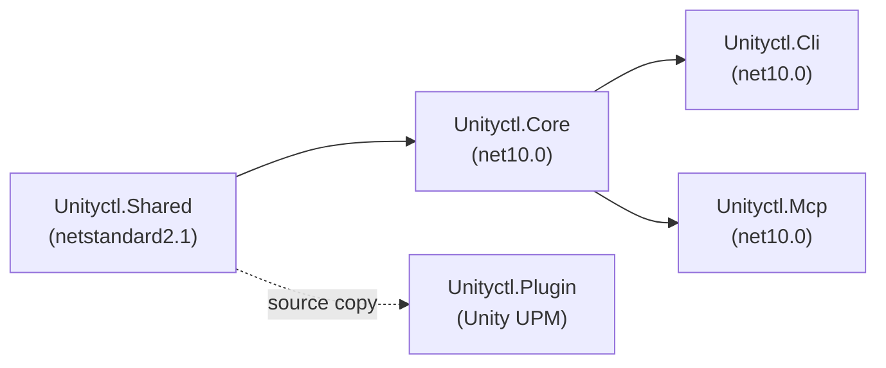
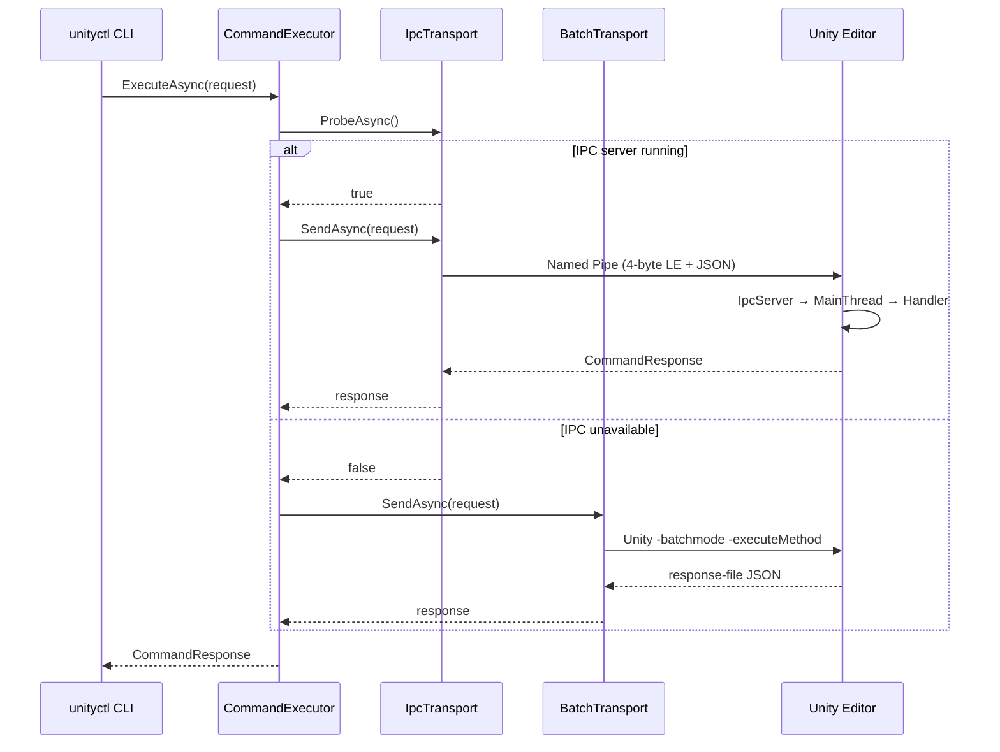

# unityctl Architecture

## Project Structure

```
unityctl.slnx
├── src/Unityctl.Shared   (netstandard2.1)  Protocol, models, constants
├── src/Unityctl.Core     (net10.0)         Business logic (transport, discovery, retry)
├── src/Unityctl.Cli      (net10.0)         CLI shell → dotnet tool "unityctl"
├── src/Unityctl.Mcp      (net10.0)         MCP server → dotnet tool "unityctl-mcp"
├── src/Unityctl.Plugin   (Unity UPM)       Editor bridge (IPC server)
└── tests/*                                 538+ xUnit tests
```

## Dependency Direction



## Transport Flow



## IPC Server (Plugin)

```mermaid
graph TD
    subgraph "Background Thread"
        Listen["ListenLoop()"]
        Pipe["NamedPipeServerStream"]
        Read["MessageFraming.ReadMessage()"]
    end

    subgraph "Main Thread (EditorApplication.update)"
        Pump["PumpMainThreadQueue()"]
        Route["IpcRequestRouter.Route()"]
        Handler["CommandHandler.Execute()"]
    end

    Listen --> Pipe --> Read
    Read -->|ConcurrentQueue| Pump
    Pump --> Route --> Handler
    Handler -->|ManualResetEventSlim.Set()| Listen
```

## MCP Server


33 MCP tools including `unityctl_run` (70 write commands via allowlist), `unityctl_schema`, `unityctl_asset_find`, `unityctl_gameobject_find`, `unityctl_screenshot_capture`, and more.

## Wire Protocol

```
Frame:    [4 bytes int32 LE: payload length] [N bytes UTF-8: JSON body]
Max size: 10 MB

CommandRequest  → { command, parameters, requestId }
CommandResponse → { statusCode, success, message, data, errors, requestId }
```

## Pipe Name Generation

```
NormalizeProjectPath(path)
  → GetFullPath → lowercase (Windows) → \ → / → trim trailing /
GetPipeName(path)
  → SHA256(normalize(path)) → hex → "unityctl_" + first 16 chars
  → 25 characters total (e.g., "unityctl_a1b2c3d4e5f6a7b8")
```

## Transport Comparison

| | IPC | Batch |
|---|---|---|
| Requires running Editor | Yes | No |
| Latency | ~100ms | 30-120s |
| Platform | Named Pipe (Win) / UDS (macOS/Linux) | All |
| Streaming support | Yes (Watch Mode) | No |
| Write commands | Yes | Limited |
| CI/CD friendly | No | Yes |
